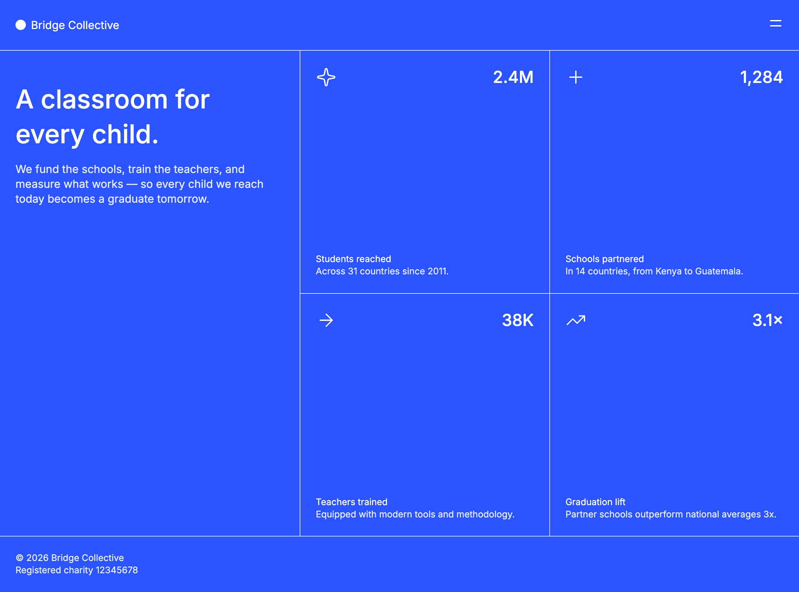

# Frontend Mentor - Grid landing page solution

A responsive charity landing page built for the [Frontend Mentor Grid landing page challenge](https://www.frontendmentor.io/challenges/grid-landing-page). The page presents Bridge Collective's mission and impact figures, with a responsive layout that works across mobile and desktop screen sizes.

## Table of contents

- [Overview](#overview)
  - [The challenge](#the-challenge)
  - [Screenshot](#screenshot)
  - [Links](#links)
- [My process](#my-process)
  - [Built with](#built-with)
  - [What I learned](#what-i-learned)
  - [Project structure](#project-structure)
  - [Running the project](#running-the-project)
  - [Responsive behavior](#responsive-behavior)
  - [Continued development](#continued-development)
  - [Useful resources](#useful-resources)
  - [AI Collaboration](#ai-collaboration)
- [Author](#author)
- [Acknowledgments](#acknowledgments)

## Overview

### The challenge

Build a responsive charity landing page that presents Bridge Collective's mission and impact figures, ensuring it works seamlessly across mobile and desktop screen sizes.

### Screenshot



### Links

- Solution URL: _Add the URL to your solution_
- Live Site URL: _Add the URL to your live site_

## My process 

### Built with

- Semantic HTML5
- CSS custom properties
- CSS Grid and Flexbox
- Responsive CSS media queries
- Vanilla JavaScript
- Local Inter variable font

### What I learned

During this project, I gained experience in building a fully responsive landing page using CSS Grid and Flexbox. I also improved my skills in managing local fonts and creating a clean project structure for static websites. Additionally, I learned how to implement a mobile-first design approach and handle responsive navigation menus effectively.

### Project structure

```text
.
├── index.html
├── assets/
│   ├── fonts/inter/
│   ├── images/
│   ├── scripts/main.js
│   └── styles/
│       ├── base.css
│       └── styles.css
└── style-guide.md
└── README.md
```

### Running the project

This is a static project with no dependencies or build step. Open `index.html` directly in a browser, or serve the project directory with any static file server.

For example, with Python installed:

```bash
python3 -m http.server
```

Then open `http://localhost:8000`.

Or if you have VS Code installed, open the project folder in it and use the Live Server extension to serve the project locally.

### Responsive behavior

- Mobile styles are the default and use a single-column layout.
- At `1024px` and above, the main content uses two columns and the impact cards form a 2x2 grid.
- The navigation panel expands from the top on mobile and slides in from the right on desktop.

### Continued development

In future iterations, I plan to enhance the accessibility features, optimize performance, and explore more advanced CSS techniques for layout and animations.

### Useful resources

- [CSS Grid Guide](https://css-tricks.com/snippets/css/complete-guide-grid/)
- [Flexbox Guide](https://css-tricks.com/snippets/css/a-guide-to-flexbox/)
- [Responsive Design Basics](https://web.dev/responsive-web-design-basics/)

### AI Collaboration

The majority of this project was developed independently, with AI assistance primarily used for generating documentation and some help with the menu animations.

## Acknowledgments

Design and content requirements are based on the [Frontend Mentor Grid landing page challenge](https://www.frontendmentor.io/challenges/grid-landing-page).

